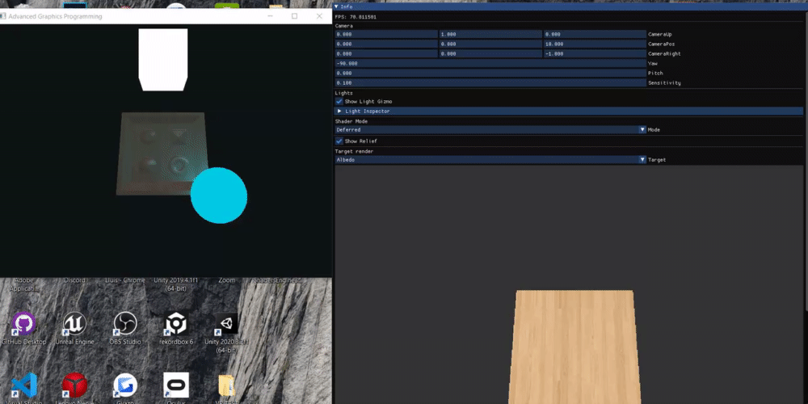

# OpenGL-Shaders-Engine
3nd delivery for Advanced Graphics Programming from CITM college

## Authors

Iván Ropero García [RoperoIvan](https://github.com/RoperoIvan)

Lluís Moreu Farran [youis11](https://github.com/youis11)

## Links

Github repository: https://github.com/Los-Chavaleh/OpenGL-Shaders-Engine

Github organization: https://github.com/Los-Chavaleh/

## Relief Mapping

Relief vs No Relief

To Enable it, there's a checkbox on the inspector called "Show Relief".

Also you can see the 3D Camera and a comboBox that allows you to see the forward shading.

